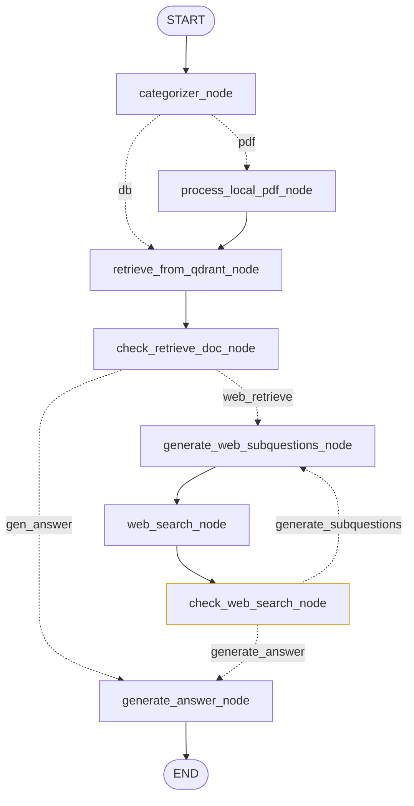

# AI Research Assistant (Dockerized) DEV BRANCH

This project is a sophisticated **AI Research Assistant** built with a **FastAPI** backend and a **React (TypeScript)** frontend. It leverages **LangGraph** for advanced RAG (Retrieval-Augmented Generation) workflows, allowing users to analyze local PDFs and perform real-time web research using **Gemini** and **Tavily**.

---

Now I change the agent with itself corrective ability called Corrective RAG, as below:

