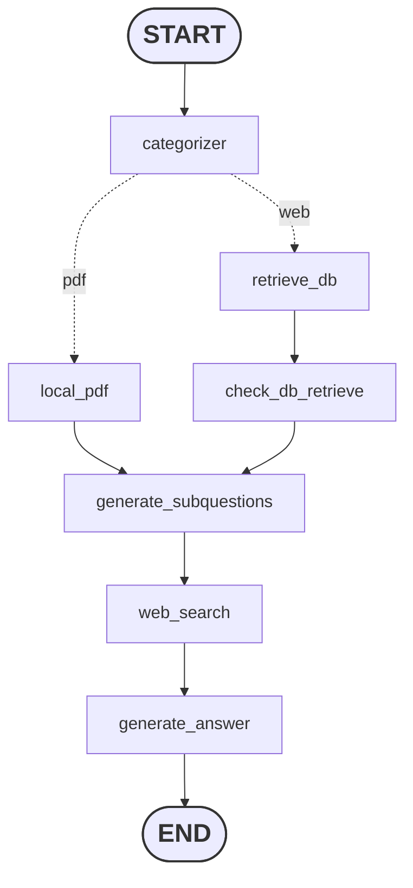

# AI Research Assistant (Dockerized)

This project is a sophisticated **AI Research Assistant** built with a **FastAPI** backend and a **React (TypeScript)** frontend. It leverages **LangGraph** for advanced RAG (Retrieval-Augmented Generation) workflows, allowing users to analyze local PDFs and perform real-time web research using **Gemini** and **Tavily**.

---
### The previous version



### The latest version with corrective RAG


---

## Features

* **Chat Streaming:** Real-time token-by-token response for a smooth UI experience.
* **PDF RAG:** Upload and query local PDF documents using ChromaDB.
* **Web Search:** Integrated Tavily search for up-to-date information.
* **Dockerized Workflow:** One-command setup for both frontend and backend services.

---

## Understanding the Docker Setup

This project uses **Docker Compose** to manage two main services:

1. **Backend:** A Python 3.11 environment running FastAPI and LangGraph.
2. **Frontend:** A Node.js environment running the Vite/React development server.

### Concept Overview

* **Dockerfile:** The "recipe" used to build the environment.
* **Docker Image:** The "frozen" version of your app including all libraries (Numpy, LangChain, etc.).
* **Docker Container:** The actual "running" instance of your application.

---

## Getting Started with Docker

### 1. Prerequisites

* Install [Docker Desktop](https://www.docker.com/products/docker-desktop/) (Windows/Mac) or Docker Engine (Linux).
* Ensure Docker is running (check the whale icon in your taskbar).

### 2. Configure Environment Variables

Create a `.env` file in the **root directory** (same level as `docker-compose.yml`) and add your API keys:

```env
GOOGLE_API_KEY=your_gemini_api_key_here
TAVILY_API_KEY=your_tavily_api_key_here

```

### 3. Launch the Application

Open your terminal in the project root and run:

```bash
docker-compose up --build

```

* **`--build`**: This flag ensures that Docker rebuilds the images if you've made changes to the `requirements.txt` or `package.json`.
* **Note:** The initial build may take 5-10 minutes as it downloads base images (Python 3.11 & Node 20) and installs dependencies.

---

## Accessing the App

Once the containers are running, you can access the services at:

| Service | URL | Description |
| --- | --- | --- |
| **Frontend** | [http://localhost:5173](https://www.google.com/search?q=http://localhost:5173) | The Chat Interface |
| **Backend API** | [http://localhost:8000/docs](https://www.google.com/search?q=http://localhost:8000/docs) | Interactive API Documentation (Swagger) |

---

## Project Structure

```text
.
├── docker-compose.yml       # The "Orchestrator" for all services
├── Dockerfile.backend       # Instructions for Python/FastAPI environment
├── main.py                  # Entry point for the Backend
├── requirements.txt         # Python dependencies
├── .env                     # Your private API keys
├── src/                     # Backend logic (LangGraph)
│   ├── retrieve.py          # Data retrieval logic
│   ├── generate.py          # Answer generation logic
│   ├── embedding.py         # PDF embedding & vectorization
│   ├── graph.py             # LangGraph state machine setup
│   └── schema.py            # Data models and schemas
└── frontend/                # React application
    ├── Dockerfile           # Instructions for Node/React environment
    ├── package.json         # Frontend dependencies
    └── src/                 # React source code (App.tsx, etc.)

```

---

## Useful Docker Commands

| Command | Action |
| --- | --- |
| `docker-compose up -d` | Run containers in the background (detached mode). |
| `docker-compose stop` | Stop the running containers without removing them. |
| `docker-compose down` | Stop and **remove** containers and networks (Clean up). |
| `docker-compose down -v` | Stop and remove everything, **including uploaded PDFs**. |
| `docker logs -f backend` | Stream logs from the backend to see AI "thinking" process. |

---

## Troubleshooting

* **Port Conflict:** If you see `Port 8000 is already allocated`, make sure you aren't running the backend locally via `uvicorn` outside of Docker.
* **Library Errors:** If `pip install` fails (especially for `numpy` or `chromadb`), ensure your `Dockerfile.backend` starts with `FROM python:3.11-slim` as required by modern AI libraries.
* **Environment Changes:** If you change a key in `.env`, run `docker-compose down` and then `docker-compose up` again to refresh the environment variables.
=======


